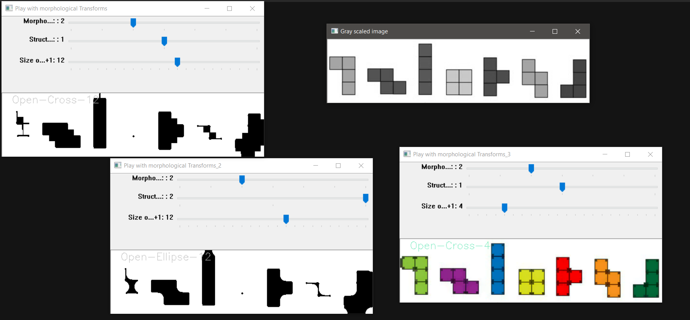

## Created a HighGUI to play with Morphological transformations and get intuitive understanding of how the operations work on images.

#### Usage : python morph_highgui.py -i [image]

----

Versions:
- Python 3.6.4
- OpenCV 3.4.1
